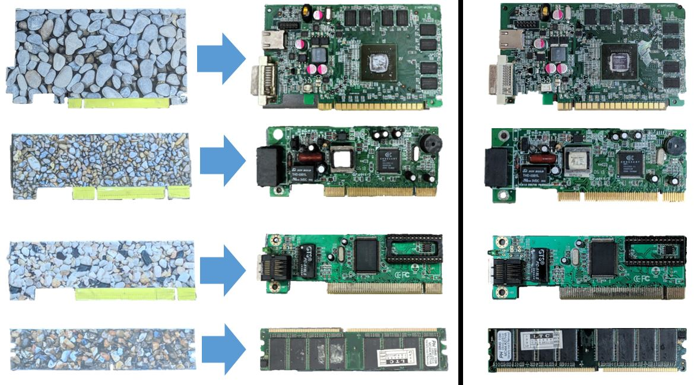
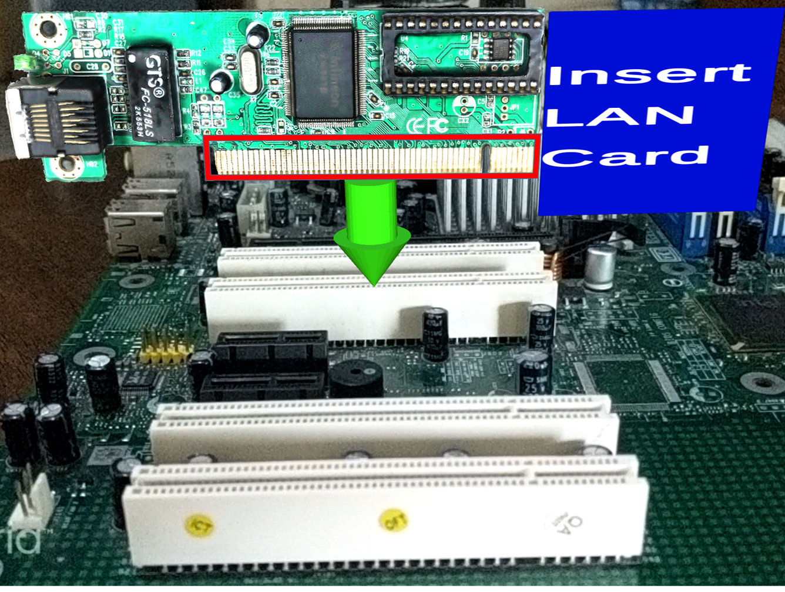
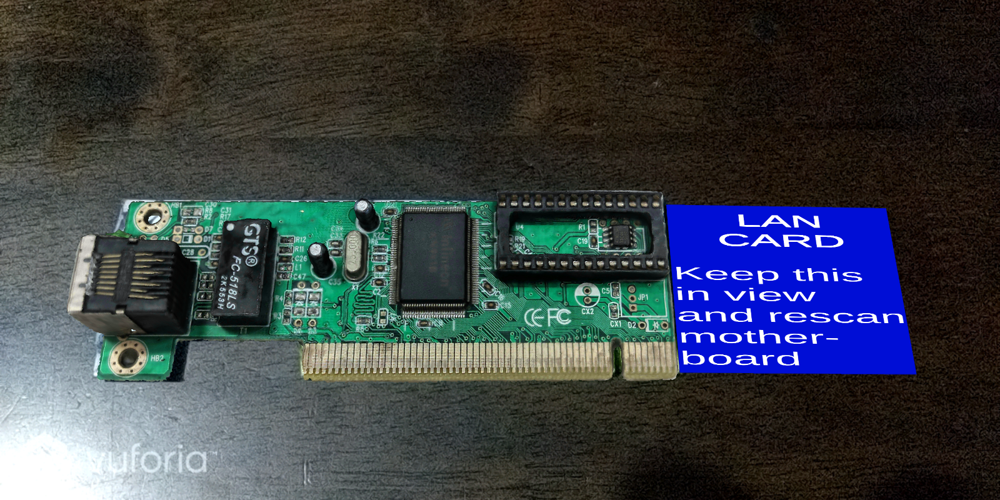
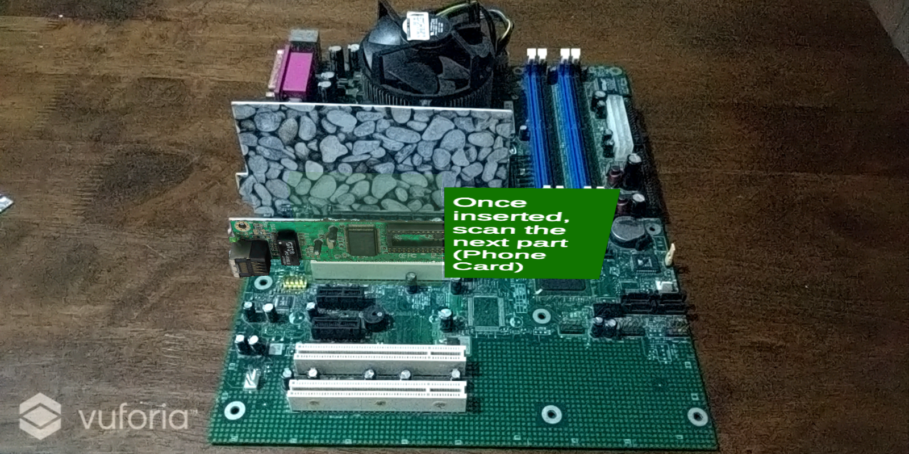
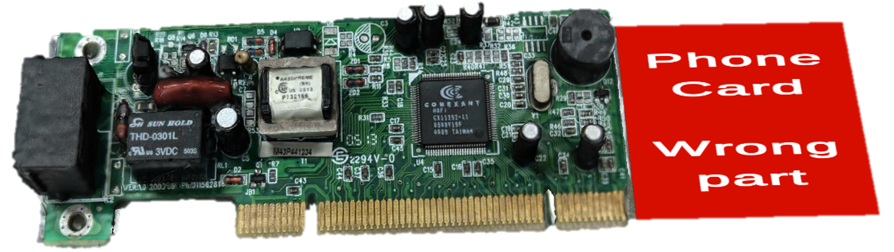
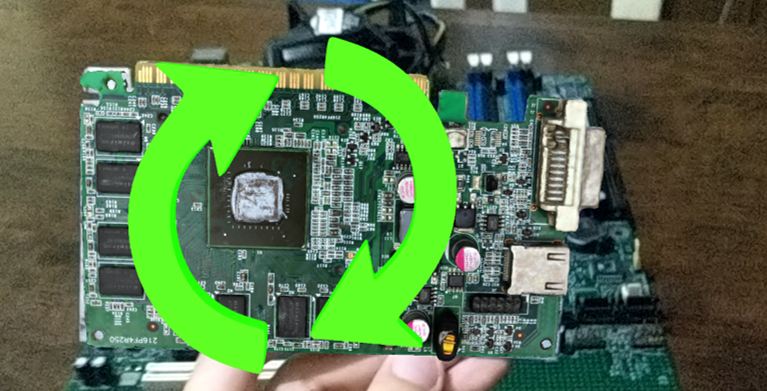
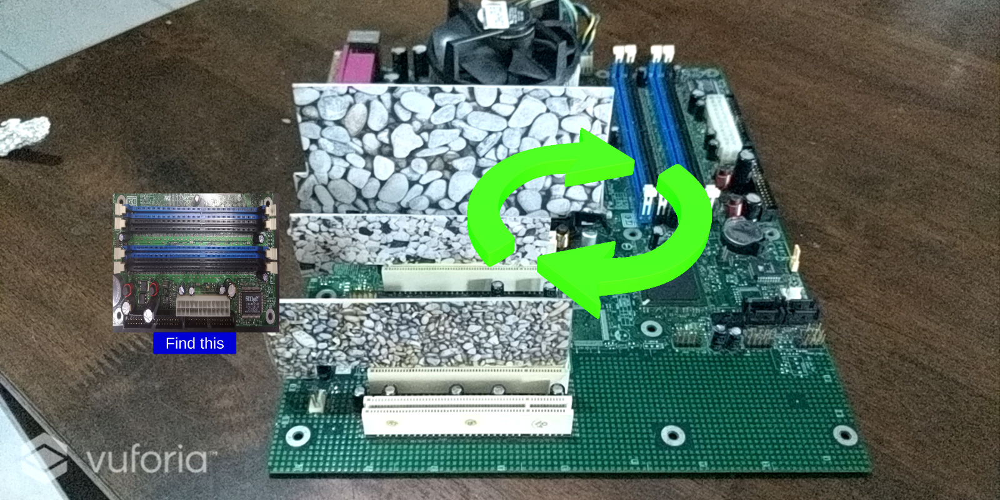

Mixed Reality Training System
Developed using Unity 3D 2018.3.7f1 with Vuforia 8.0.10 plug-in
Deployed on a Google Pixel XL with VR Box headset

This project uses AR targets overlaid with virtual target to allow natural interaction in a mixed reality environment. Four motherboard parts were used in this project as a proof of concept. The physical targets used were illustration board cutouts of the motherboard parts layered with images of stones. The virtual motherboard part is then mapped to the physical object and projected through a see-through device. Below is an illustration of this

Left of the image is the illustration board cutouts with stone images, in the middle is the AR target overlaid with its virtual counterpart and on the right is an image of the actual part. Photogrammetry was used in creating the virtual objects as to preserve as much of the details as possible. 

Guide cues were also implemented to assist users in partial assembly of the motherboard. The AR targets were used as a replacement of the actual parts for the assembly. The guide cues consists of instructional cues as well as positive and negative feedbacks. 

The application also includes directional cues to assist users in the required movement for a certain subtask. Animated rotational arrows were used to inform users how to rotate a part and how to rotate the motherboard when needed

